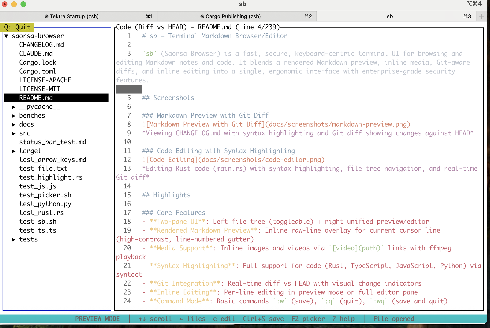
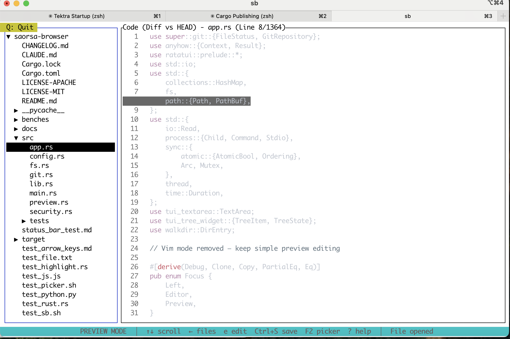

# sb — Terminal Markdown Browser/Editor

[](https://github.com/davidirvine/saorsa-browser)
[](LICENSE)
[](https://www.rust-lang.org)

`sb` (Saorsa Browser) is a fast, secure, keyboard-centric terminal UI for browsing and editing Markdown notes and code. It blends a rendered Markdown preview, inline media, Git-aware diffs, and inline editing into a single, ergonomic interface with enterprise-grade security features.

## Screenshots

### Markdown Preview with Git Diff

*Viewing CHANGELOG.md with syntax highlighting and Git diff showing changes against HEAD*

### Code Editing with Syntax Highlighting

*Editing Rust code (main.rs) with syntax highlighting, file tree navigation, and real-time Git diff*

## Highlights

### Core Features
- **Two-pane UI**: Left file tree (toggleable) + right unified preview/editor
- **Rendered Markdown Preview**: Inline raw-line overlay for current cursor line (high-contrast, line-numbered gutter)
- **Media Support**: Inline images and videos via `[video](path)` links with ffmpeg playback
- **Syntax Highlighting**: Full support for code (Rust, TypeScript, JavaScript, Python) via syntect
- **Git Integration**: Real-time diff vs HEAD with visual change indicators
- **Inline Editing**: Per-line editing in preview mode or full editor pane
- **Command Mode**: Basic commands `:w` (save), `:q` (quit), `:wq` (save and quit)
- **File Operations**: Midnight-Commander-style Copy/Move/Mkdir/Delete with modern confirmation dialogs
- **Context-Aware Status Bar**: Dynamic command hints that change based on current mode and focus

### Security & Performance Features
- **🔒 Security Hardening**: Complete path traversal protection and input validation
- **⚡ Async I/O**: High-performance file operations with Tokio
- **💾 Intelligent Caching**: Directory and file preview caching with TTL
- **📊 Performance Monitoring**: Built-in metrics tracking and benchmarking
- **🔍 Structured Logging**: Comprehensive audit trail with security event tracking
- **🛡️ Resource Protection**: File size limits and memory-bounded operations

## Security & Architecture

### Security Features
- **Path Traversal Protection**: Comprehensive validation prevents access outside allowed directories
- **File Size Limits**: Configurable limits prevent resource exhaustion (default: 10MB max file, 1MB preview)
- **Input Sanitization**: All user inputs validated and sanitized for security
- **Error Message Sanitization**: Sensitive information stripped from error messages
- **Audit Logging**: Security events logged with structured data for monitoring

### Performance Architecture
- **Async I/O**: Non-blocking file operations using Tokio for responsive UI
- **Multi-layer Caching**: 
  - Directory cache with 30s TTL
  - File preview cache with 60s TTL  
  - LRU eviction with memory bounds
- **Streaming**: Large files handled via streaming to prevent memory issues
- **Metrics**: Built-in performance monitoring with timing and cache hit rates

### Testing & Quality
- **80%+ Test Coverage**: Comprehensive unit, integration, and security tests
- **Property-based Testing**: Edge case validation with randomized inputs
- **Security Test Suite**: Dedicated tests for vulnerability prevention
- **Performance Benchmarks**: Automated performance regression detection

## Prerequisites

- Rust toolchain (stable)
- ffmpeg in your PATH (required for video playback)
  - macOS: `brew install ffmpeg`
  - Ubuntu/Debian: `sudo apt-get install ffmpeg`

## Build & Run

```bash
# Build
cargo build --release

# Run (open a directory of notes)
cargo run --release -- /path/to/your/notes

# Or run the compiled binary
./target/release/sb /path/to/your/notes

# Run with debug logging
RUST_LOG=debug ./target/release/sb /path/to/your/notes

# Test file picker functionality
./test_sb.sh  # Interactive test script for file picker

# Run performance demo
cargo run --example performance_demo

# Run benchmarks
cargo bench
```

## Configuration

The application supports environment-based configuration:

- `RUST_LOG`: Logging level (error, warn, info, debug, trace)
- Security settings are configured at compile time for maximum safety
- Default limits: 10MB max file size, 1MB preview size
- Cache settings: 30s directory TTL, 60s file preview TTL

## Keybindings

### Navigation & Focus
- **Tab / Shift+Tab**: Cycle focus between visible panes
- **Left/Right Arrows**: Smart pane switching (in Preview/Files modes only)
  - **Left Arrow in Preview**: Switch to Files pane (if visible)
  - **Right Arrow in Files**: Switch to Preview/Editor pane (expands directories first)
- **Ctrl+B or F9**: Toggle Files pane visibility
- **Q or F10**: Quit application (prominent yellow indicator in top-left)
- **Esc**: Exit raw editor mode or quit from preview

### Files Pane (Left)
- **↑↓←→ or j/k**: Navigate file tree
- **Enter**: Toggle folder / open file
- **D**: Delete file/folder (modern confirmation dialog)
- **N**: Create new file (.md extension suggested)
- **F5**: Copy file/folder
- **F6**: Move/rename file/folder
- **F7**: Create new directory
- **F8**: Delete (same as D)
- **O**: Open file externally in default application

### Preview Mode (Right Pane)
- **↑↓ or j/k**: Scroll content
- **←→**: Scroll horizontally
- **h**: Toggle Files pane visibility (hide/show)
- **e**: Enter raw editor mode
- **Mouse wheel**: Scroll content
- **Ctrl+I**: Insert link via file picker (see File Picker section)
- **Ctrl+S**: Save current file

### Editor Mode (Right Pane)
- **Full text editing**: Type freely to edit content
- **:**: Open command prompt (supports `:w` save, `:q` quit, `:wq` save & quit)
- **Esc**: Return to preview mode
- **Tab**: Temporarily exit editor (remembers state when returning)
- **Mouse wheel**: Scroll content

### Video Playback
- **Space**: Pause/resume video
- **s**: Stop video
- **Ctrl+V**: Toggle autoplay for videos

### General
- **?**: Toggle help overlay
- **Ctrl+S**: Save current file

### File Picker (Ctrl+I)
The file picker provides Git-aware file selection with the following features:
- **↑↓ or j/k**: Navigate files
- **Enter**: Select file and insert link
- **D**: Delete file (with Git rm support if in repo)
- **P**: Navigate to parent directory
- **S**: Show Git repository status
- **ESC**: Cancel and return to editor

Git status indicators on files:
- **[M]**: Modified (yellow)
- **[A]**: Added (green)
- **[D]**: Deleted (red)
- **[?]**: Untracked (blue)
- **[C]**: Conflicted (magenta)

## UI Features

### Visual Indicators
- **Q: Quit**: Prominent yellow badge in top-left corner for easy exit
- **Focus Indicators**: Cyan border for active pane, blue for inactive
- **File Status**: Git changes shown with visual diff indicators
- **Context-Sensitive Status Bar**: Persistent cyan bar at bottom showing:
  - Dynamic commands based on current mode (Preview/Editor/Files)
  - Real-time updates when switching focus or modes
  - Current application status and messages
  - Clear, bold text on cyan background for excellent visibility

### Modern Dialogs
- **Delete Confirmation**: Azure-style modal with:
  - Warning icon (⚠️) in title
  - Highlighted filename
  - Color-coded confirm (green) / cancel (red) buttons
  - "This action cannot be undone" warning
  - Semi-transparent background overlay

## How it Works

### Markdown Rendering
- Markdown files are parsed and rendered as styled terminal text
- Current line shows as raw text overlay (yellow background) with line numbers
- Rest of content remains rendered for context while editing

### Media Support
- **Images**: Loaded via `image` crate and rendered inline with `ratatui-image`
- **Videos**: Uses ffmpeg to extract frames, displayed in preview area
  - Supports `[video](path.mp4)` markdown syntax
  - Automatic playback of first video in document

### Code Features
- **Syntax Highlighting**: Via syntect for Rust, TypeScript, JavaScript, Python, etc.
- **Git Integration**: Shows diff against HEAD for tracked files
- **Line-by-line comparison**: Visual indicators for added/modified/deleted lines

### Editing Modes
- **Preview Mode**: View rendered content with single-line editing capability
- **Editor Mode**: Full text editor with syntax awareness
- **Command Mode**: Quick commands via `:` prefix

## Troubleshooting

### General Issues
- **Preview shows raw text**: Ensure file has `.md` extension
- **Video playback fails**: Verify ffmpeg is installed and in PATH
- **Terminal rendering issues**: Use modern terminal with truecolor support
- **Git diff not shown**: File must be tracked in git repository

### Security & Performance
- **File access denied**: Files must be within base directory, no `../` paths
- **File too large**: Default 10MB limit for files, 1MB for previews
- **Slow performance**: Enable `RUST_LOG=debug` to check cache hit rates

### Monitoring & Debugging
- **Enable logging**: Set `RUST_LOG=debug` for detailed metrics
- **Security events**: Validation failures logged with context
- **Performance metrics**: Cache hit rates and timings in debug logs

## Roadmap

- Enhanced text navigation (word-by-word movement, paragraph jumps)
- Undo/redo functionality
- Inline code block improvements
- Video seeking and timing controls
- Configurable themes and keybindings
- Search functionality within files
- Multiple file tabs

## Notes

- Terminal UI optimized for keyboard navigation
- Mouse support available but optional
- Tested on macOS and Linux with modern terminals
- Requires UTF-8 terminal encoding for proper rendering